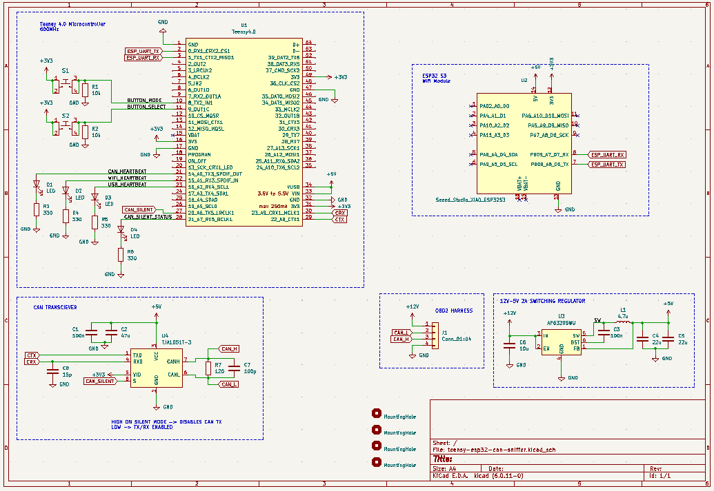
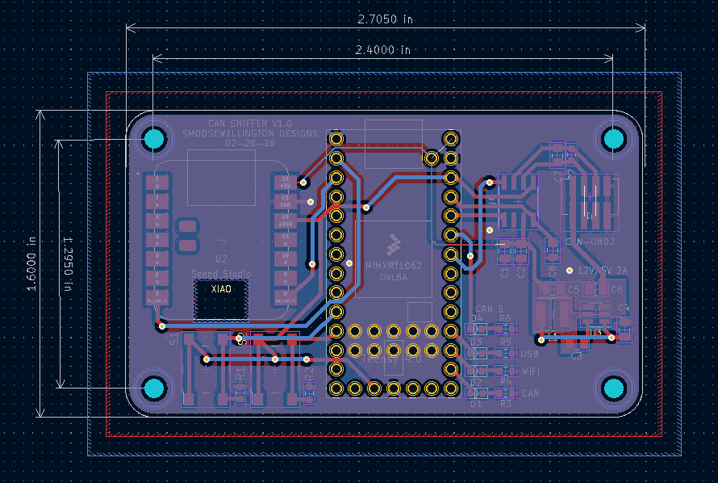
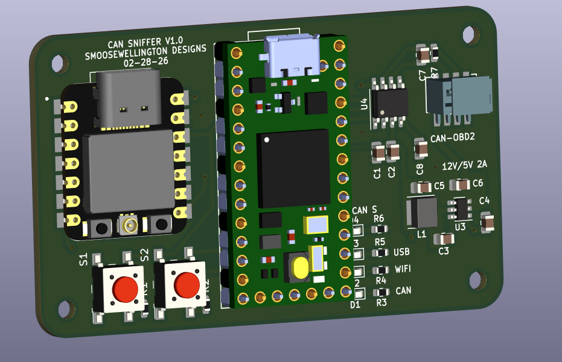

# Teensy + ESP32 CAN Sniffer PCB

This document summarizes the current PCB design and shows the latest schematic, layout, and 3D model captures.

## Overview
This board is a carrier for a Teensy (CAN host) and an ESP32 module (Wi‑Fi gateway), with a CAN transceiver and support circuitry for bench or in‑vehicle CAN sniffing.

## Schematic

## PCB Layout

## 3D Model

## Notes
- These images are for documentation and review; update them when the design changes.
